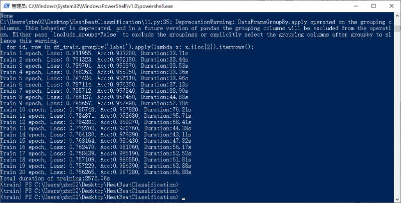
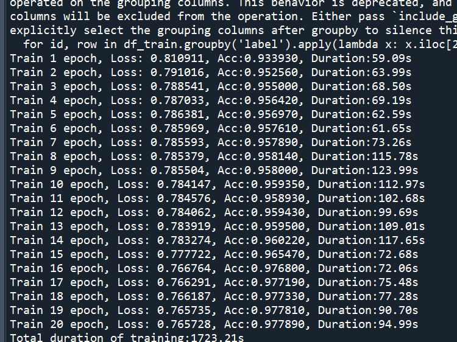
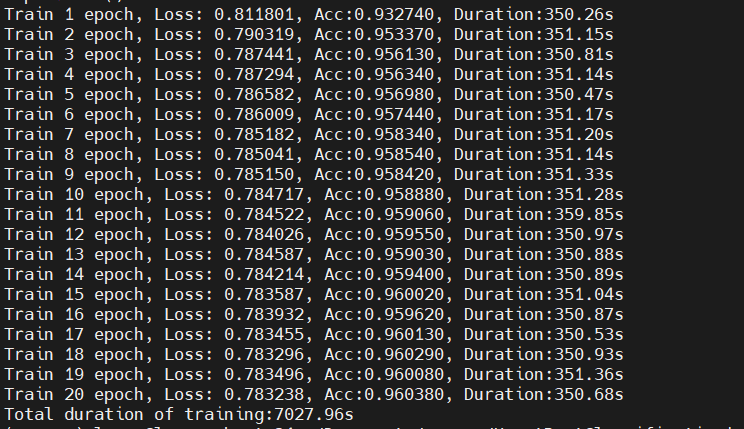

# HeatBeatClassification

---

## How to use?

### Environment install
Use `Powershell` or `Cmd` input
`pip install -r "requirement.txt`
### Usage
cd to root directory
`python 11.py`

## 不同计算平台下的耗时对比

### <1> 英特尔® 酷睿™ i5-13600K 处理器
#### 【参数】：
```
内核数 14
Performance-core（性能核）数6
Efficient-core（能效核）数8
总线程数 20
最大睿频频率 5.1 GHz
Performance-core（性能核）最大睿频频率 5.10 GHz
Efficient-core（能效核）最大睿频频率 3.90 GHz
Performance-core（性能核）基本频率 3.50 GHz
Efficient-core（能效核）基本频率 2.60 GHz
缓存 24 MB Intel® Smart Cache
二级高速缓存总容量20 MB
处理器基础功耗 125 W
最大睿频功耗 181 W
```
#### 【计算耗时】：
```
每个epoch最短33.36s，最长95.71s，总耗时2576.06s
```



### <2> AMD Ryzen 7 PRO 4750U with Radeon Graphics
#### 【参数】：
```
处理器内核、基本频率和涡轮增压频率
直接影响处理器性能的特征。工作和涡轮增压速度，超频，超交易的核心和线程数量。越多越好。

时钟频率:	1.70 GHz	 	核心数量:	8
涡轮增压（1核）:	4.10 GHz	 	流的数量:	16
超级交易:	Yes	 	加速:	No
Turbo (8 Cores):	3.10 GHz	 
L3-Cache:	8.00 MB	 	技术:	7 nm
建筑学:	Renoir (Zen 2)	 	虚拟化:	AMD-V, SEV
插座（连接器）:	FP6	 	发布日期:	Q2/2020
指令集（ISA）:	AMD64	
``` 
#### 【计算耗时】：
```
每个epoch平均110s，总耗时2200多s
```
### <3> 英特尔® 酷睿™ i7 处理器 14700HX
#### 【参数】：
```
内核数 20
Performance-core（性能核）数8
Efficient-core（能效核）数12
总线程数 28
最大睿频频率 5.5 GHz
英特尔® Thermal Velocity Boost 频率 5.5 GHz
英特尔® 睿频加速 Max 技术 3.0 频率 ‡ 5.4 GHz
Performance-core（性能核）最大睿频频率 5.5 GHz
Efficient-core（能效核）最大睿频频率 3.9 GHz
Performance-core（性能核）基本频率 2.1 GHz
Efficient-core（能效核）基本频率 1.5 GHz
缓存 33 MB Intel® Smart Cache
处理器基础功耗 55 W
最大睿频功耗 157 W
最小保证功率45 W
英特尔® 深度学习提升 Yes
```
#### 【计算耗时】：
```
每个epoch最短59.09s,最长123.99s,总耗时1723.21s
```


### <4> 树莓派5 BCM2712
#### 【参数】：
```
Broadcom BCM2712 是树莓派5核心的 16 纳米应用处理器。它是树莓派4中使用的 BCM2711 器件的后续产品，与树莓派早期产品中使用的BCM27xx系列中的其他器件具有许多共同的架构特性。
它围绕四核 Arm Cortex-A76 CPU 集群构建，主频高达 2.4GHz，具有 512KB 每核二级缓存和 2MB 共享三级缓存，集成了改进的 12 核 VideoCore VII GPU、能够驱动双 4kp60 显示器的硬件视频缩放器和 HDMI 控制器，以及树莓派开发的 HEVC 解码器和图像信号处理器。32 位 LPDDR4X 内存接口可提供高达 17GB/s 的内存带宽，而 x1 和 x4 PCI Express 接口可支持高带宽外部外设；在树莓派5上，后者用于连接树莓派RP1南桥，该南桥提供了平台上大部分面向外部的 I/O 功能。
主要功能包括：
四核 Arm Cortex-A76 @ 2.4GHz
ARMv8-A ISA
64KByte I 和 D 高速缓存
每个内核 512KB L2，2MB 共享 L3
新的树莓派开发的 ISP
1 千兆像素/秒
改进的 HVS 和显示管道
支持双 4Kp60
VideoCore V3D VII
速度快 ~2-2.5倍（硬件更多，1GHz，而 Pi4 为 600MHz）
OpenGL ES 3.1、Vulkan 1.3
4Kp60 HEVC 硬件解码
其他 CODEC 在软件中运行
H264 1080p24 解码 ~10-20% CPU
H264 1080p60 解码 ~50-60% CPU
H264 1080p30 编码（来自 ISP）~30-40% CPU
总的来说，BCM2712 的新功能在普通 CPU 或 I/O 密集型用例中的性能比树莓派4提升了 2-3 倍。
```
#### 【计算耗时】：
```
每个epoch平均350s，总耗时7027.96s
```


### <5> NORCO EMB2582 RK3588(NO NPU)
#### 【参数】：
```
8nm process, quad-core Cortex-A76 + quad-core Cortex-A55
ARM Mali-G610 MC4 GPU, embedded high performance 2D image acceleration module
6.0 TOPs NPU， enable various AI applications
8K video codec ,8K@60fps display out
Rich Display Interface, multi-screen display
Super 32MP ISP with with HDR&3DNR, multi-camera inputs
Rich high-speed interfaces (PCIe, TYPE-C，SATA, Gigabit ethernet)
```
#### 【计算耗时】：
```
每个epoch平均390s，未记录总耗时。
注：cpu始终工作在70%左右，未达到100%
```

